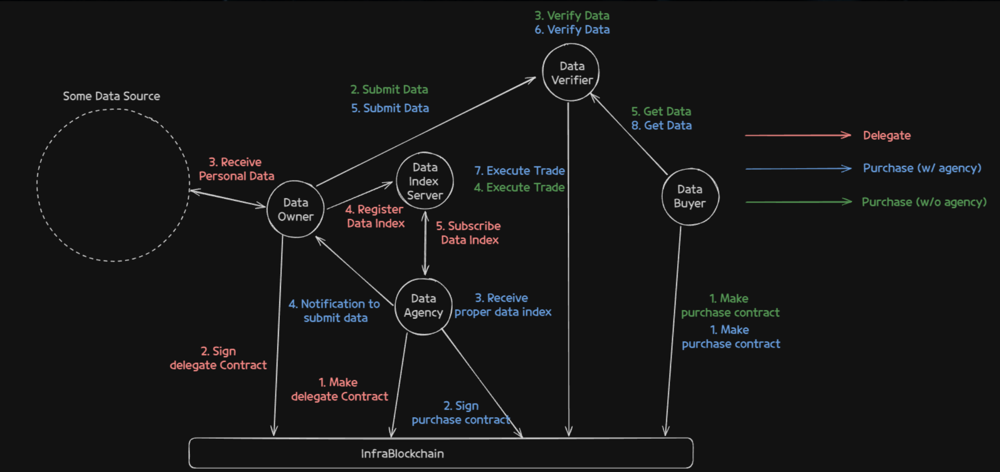
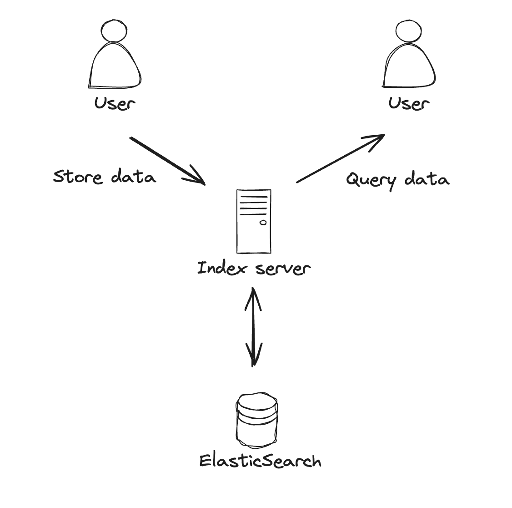
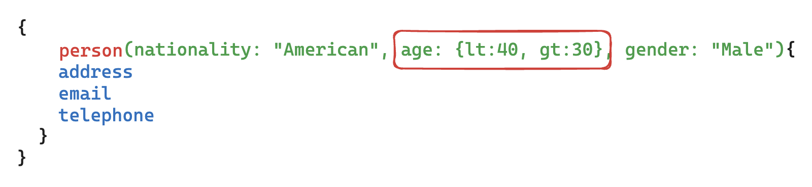
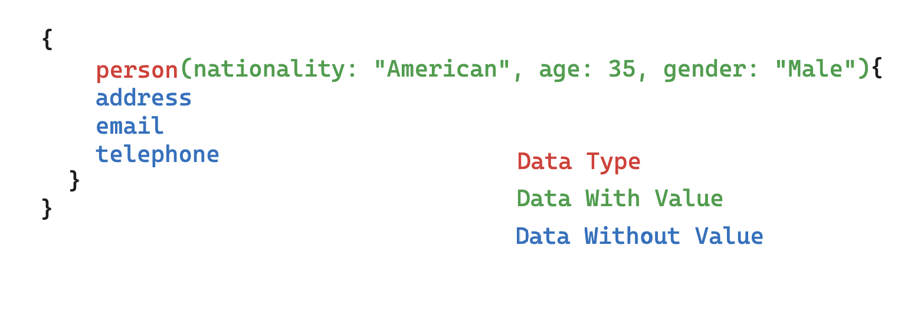
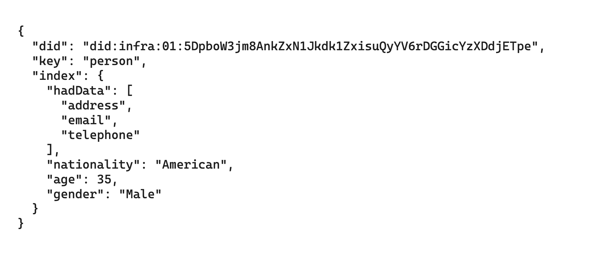
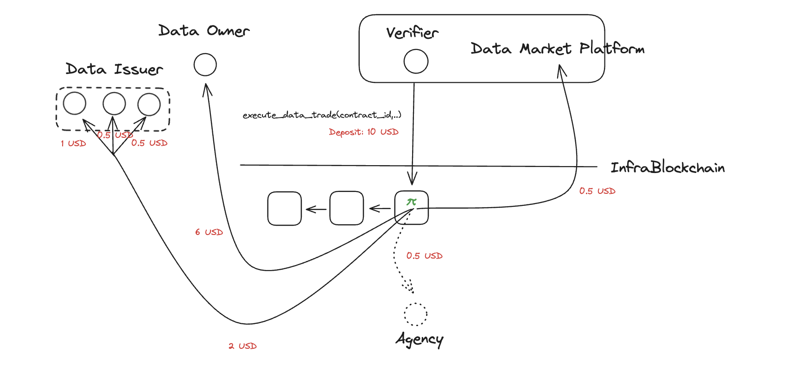

# Introduction

With the rapid advancement of AI technologies like Large Language Models (LLM), the use and security of personal data have become crucial issues. Currently, most user data is stored on centralized servers, and users do not have sufficient control over their data, such as access or deletion. As a result, there are very few platforms where users can manage and trade their data. Moreover, there is a lack of platforms where data from various services, including specific certificates or medical data, can be traded in a trustworthy manner ensuring the source and integrity.

**_Newnal Data Market_** is a platform where personal data can be traded freely in a decentralized and verifiable manner. Users can store verifiable data (Verifiable Credential) received from Data Providers in their Personal Web Node (PWN) and sell this data as a Data Package (Verifiable Presentation). Data buyers can purchase data with guaranteed source and integrity. Additionally, all financial flows through transactions are conducted on-chain, ensuring transparency.

# Participants



**`Buyer`**

The entity purchasing the data.

**`Seller(Owner)`**

The entity operating the PWN and selling the data. The data stored in the PWN is packaged as a Data Package and submitted to the Verifier.

**`Agency`**

Periodically queries the Index Server for data sellers matching the transaction conditions on behalf of the Seller or Buyer and sends Data Package submission alerts.

**`Verifier`**

The trusted data transaction validator designated by the Buyer, who verifies the Data Package submitted by the Seller. Identified by DID.

**`PWN(Personal Web Node)`**

A personal web node operated by the Data Owner. Personal data issued by the Data Provider is stored in the PWN, and the index information of the data is stored in the Index Server.

**`Data Provider(Issuer)`**

Various services that issue data in a verifiable form (VC) to users. (e.g., Netflix, Instagram, Google)

**`PWN Index Server`**

A server that indexes identification information and data categories of DID received from the PWN and provides a list of DIDs that meet specific conditions.

**`Data Market Service`**

Handles authentication and various functions for buyers, sellers, and agents, and interaction between the Data Market Chain.

**`Data Market Chain`**

A blockchain (parachain) containing the service logic of the Data Market. Consists of smart contracts for data purchase registration and transaction, agency registration, and delegation.

**`DID Chain`**

A blockchain (parachain) containing the service logic related to DID. Consists of smart contracts for DID registration and revocation, document query, and modification.

# Main Components

## Data Package

-   A data-package is a zip file composed of personal data arranged by the Owner according to the data transaction conditions, consisting of VC and File, verifying the source and integrity of the data.
    -   The source of the data can be legally verified through VC signature verification.
    -   If the data issued with the VC includes a File, the source and integrity of the File can be verified through the digest credentialSubject of the VC (\*.json) with the same name as the File.
-   The index.json, which shows the file structure of the data-package, is a VC signed by the Owner and is similar to a file system.
    -   "\_dataScope": The data range specified by the buyer when purchasing data. The Owner must compose the data package with personal data matching this scope.
    -   “\_type”: Indicates the type of the file. VC (Verifiable Credential), Bin (file), Dir (folder).
    -   For Bin (file) type, there must be a VC with the same name as the file, and the VC must have digest and originalFilename as credentialSubject.

```json
//index.json (VC signed by Owner)
{
    "_dataScope": "{ lifestyle(     category: \"Electronics\",     totalPrice: {amount: {lt:1000, gte:100}},     startTime: {gte: 1648517600, lt: 1648717600}     ) }",
    "purchaseElectronics.json" : { "_type": "VC", "_digest" : "someHash" },
    "facebook" : {
      "_type" : "DIR",
      "profile.json" : { "_type": "VC", "_digest" : "someHash" },
      "data" : {
         "_type" : "DIR",
         "facebookWatch2301-2404.json" : { "_type" : "VC", "_digest" : "someHash" },
         "instagramImgs2404.json" : { "_type" : "VC", "_digest" : "someHash" },
         "instagramImgs2404.jpg" : { "_type" : "BIN", "_digest" : "someHash" }
      }
    },
    ... // VC related fields
};

// data-package file structure
// ├── index.json
// ├── purchaseElectronics.json
// ├── facebook
// ├─────profile.json
// ├─────data
// ├────────facebookWatch2301-2404.json
// ├────────instagramImgs2404.json
// └────────instagramImgs2404.bin
```

**Creation and Delivery of Data Package**

-   The Owner creates the data-package according to the dataScope (graphQL query) received from the index server or agency.
-   The created data package is submitted to the verifier in the following form:
    -   data-package (ZIP) ⇒ buffer ⇒ base64 encoding ⇒ encryption (JWE).
-   The Verifier obtains the data-package through the reverse process and verifies the VC, file checksum, and data scope.

## Verifier

The Verifier is the entity that verifies the data-package received from the Owner and executes the trade settlement (execute_trade) transaction upon successful verification. The Buyer can designate a trusted Verifier for the purchase, or the Buyer can operate the Verifier Server directly.


When the Owner calls the submit-data API, the Verifier performs three main tasks.

**`submit_data` API**: API for the Owner to submit the data-package to the Verifier.

-   Input Param
    -   Purchase ID
    -   Seller DID
    -   JWE: Encrypted Data Package `JWE`.
-   Data Signing and Encryption (ECDH-1PU)
    -   Data encryption between Owner and Verifier through ECDH-1PU.

**`verify_data`**: Decrypts and verifies the encrypted data-package (Verifier internal method).

-   Data Decryption and Verification
    -   Decrypts to obtain the data-package.
        -   DID authentication for the Owner during the decryption process (ECDH-1PU).
    -   Verifies the data-package.
        -   Verifies the authenticity and data scope of the decrypted data-package.
        -   Authenticity Verification: Verifies the signature of the VC in index.json and checks the integrity of the file data through the digest field of the VC.

**`execute_trade`**: Sends a transaction to execute the trade if the data-package verification is successful.

-   If verification is successful, executes the **`execute_trade`** transaction on the blockchain for trade settlement.
-   Transaction parameters:
    -   Purchase ID (contractId).
    -   Owner's DID public key (ownerDIDPk).
    -   List of data issuers (dataIssuers: issuer DID and validity period of each VC).
    -   Proof for data integrity verification (SHA256 hash of the decryptedMessage).

**`store_data`**: API to provide the data-package URL to the Buyer.

-   Uploads the verified data-package to S3 and provides the URL to the Buyer.
-   Grants authorization so that only the Buyer can call the API.

## Index Server

The Index Server is an important component that manages the index of data owned by each PWN (Personal Web Node). Through this, participants in the data market can easily identify what data is held by whom, enabling efficient data transactions.

### **Architecture**



The Index Server consists of the following components:

-   **PWN (Personal Web Node)**: Stores and manages the index of data owned by each individual.
-   **Index Server**: Stores the index sent from the PWN in ElasticSearch and searches the index according to user requests.
-   **ElasticSearch**: Stores index data and supports fast searches.

PWN uses the unique Query Language of the Index Server to store its index or query the list of DIDs holding specific index values.

### Index Server Query Language


The Index Server uses a unique Query Language to store or query Index Data.

It primarily uses GraphQL syntax, but there are differences in how each field is used compared to GraphQL.

`Data With Value` is generally composed of key-value pairs. The value can be defined regardless of type, such as `String`, `Number`, or `Object`.

Additionally, for the `Number` type, it is possible to specify a range without specifying a specific value using `gt`, `gte`, `lt`, `lte`.



`Data Without Value` is composed of key values. For fields that do not disclose the actual value, it is composed of the key values of those fields

.

### **Store Data**

When storing data in the Index Server, the Index Server Query Language sent to the Index Server is converted and stored in a format that can be stored in ElasticSearch.



For example, if the request is made as shown in the picture above, it is stored in ElasticSearch as shown below.



The part corresponding to the Data Type in the Index Server Query Language corresponds to `key`, and the part corresponding to Data With Value is included in the `index` field. The part corresponding to Data Without Value is included as field names in the Array value within the `hadData` field in the `index` field.

### **Query Data**

The Index Server can query DIDs that match the conditions of the Index Server Query. In this case, it converts and uses the Index Server Query Language into DSL (Domain Specific Language) format to be used in ElasticSearch.

The following code is an example implemented in TypeScript.

```tsx
/* ==== snip ==== */
const query = buildQuery(selection);
/* ==== snip ==== */
const result = await elasticsearchService.search({
	index: 'pwn-index-data',
	body: {
		query,
	},
});
```

By obtaining the DID that matches the given conditions, the data buyer can request a data purchase, or the agency can notify the data owner to sell the data.

# Data Market Smart Contract

## Overview

_Newnal Data Market_ is a blockchain-based data market platform that ensures decentralization and transaction transparency using smart contracts. Data buyers and sellers can conduct transactions in a P2P manner and also support transactions through agencies. In any case, a signed data transaction contract between the parties is required for the transaction to proceed, and the contract is managed through the blockchain.

Once an agreement on the data transaction contract between the parties is reached, the data is transferred from the seller to the buyer off-chain. There is a data verifier who checks the validity of the data, and the payment for the data transaction is made through a blockchain transaction. The blockchain clearly specifies the data market fee and the amount for each data transaction, and anyone can verify this information.

In the case of the agency model that sells data on behalf of the seller, the agency is managed through the blockchain. The role of the agency on the platform is to act as an intermediary by informing the buyer of the indexing information of the seller's data and receives rewards when the data transaction is completed. All information about the agency, including registration and cancellation, is managed through the blockchain.

## Contracts

_Newnal Data Market_ facilitates data transactions based on agreements between data buyers and sellers. Agreements are managed through on-chain contracts, primarily divided into **_Purchase_** and **_Delegate_** contracts.

### Purchase

The purchase contract is established between the data buyer and seller (if there is no agency) or between the seller and agency (if there is an agency).

-   If there is no agency:
    When the data seller and buyer trade directly, the buyer first creates a purchase contract through a transaction, expressing their intent to purchase. The data owner (seller) then submits the data specified in the `data_purchase_info` in the contract.
-   If there is an agency:
    Typically, the data owner (seller) trades through an agency instead of directly with the buyer. The data owner (seller) designates a trusted agency to which they can delegate their data through the [DelegateContract](notion://www.notion.so/Core-Team-3ff2a206088c48acb844d71e21e74828?p=b4da25a69eb84afcb1475e4cf41f12a6&pm=s#Delegate). The data buyer then enters into a contract with the agency through the _PurchaseContract_ regarding the data they wish to purchase.

In any case, a transaction signature between the trading parties is required for the contract to be valid. The contract is managed by being mapped to storage with `ContractId` as the key.

```rust
pub struct PurchaseContract<AccountId, BlockNumber, Balance, AssetkInd> {
    pub data_buyer: AccountId,
    pub data_verifier: Option<AccountId>,
    pub effective_at: BlockNumber,
    pub expired_at: BlockNumber,
    pub data_purchase_info: DataPurchaseInfo<AnyText>,
    pub system_token_id: AssetkInd,
    pub agency: Option<AccountId>,
    pub price_per_data: Balance,
    pub deposit: Balance,
    pub trade_count: Quantity,
    pub data_trade_record: Vec<AccountId>,
    pub signed_status: ContractSigner<AccountId>,
}
```

**Components**

`data_buyer`

Data buyer account

`data_verifier`

Data verifier account designated by the data buyer

`effective_at`

The time when the contract becomes active

`expired_at`

The time when the contract expires

`data_purchase_info`

Data purchase range

`system_token_id`

Payment method for data transactions

`agency`

Agency account, must be specified for data transactions involving an agency

`price_per_data`

Price per data unit

`deposit`

Deposit by the data buyer

`trade_count`

Number of data transactions

`data_trade_record`

Records of data transactions to prevent duplicate transactions and save transaction accounts

`signed_status`

Signature status between the trading parties (seller and buyer or agency and buyer)

### Delegate

A delegation contract is written when there is an agency involved in the data transaction, between the seller and the agency or the buyer and the agency.

```rust
pub struct DelegateContract<AccountId, BlockNumber> {
    pub data_owner: AccountId,
    pub agency: AccountId,
    pub data_owner_minimum_fee_ratio: u32,
    pub deligated_data: AnyText,
    pub effective_at: BlockNumber,
    pub expired_at: BlockNumber,
    pub signed_status: ContractSigner<AccountId>,
}
```

**Components**

`data_owner`

Data seller or owner account

`agency`

Agency account to which the data owner delegates their data index information

`data_owner_minimum_fee_ratio`

Minimum profit distribution ratio for the data owner

`effective_at`

The time when the contract becomes active

`expired_at`

The time when the contract expires

`signed_status`

Signature status between the trading parties (owner and agency)

## Execute



Once an agreement is reached on the _Purchase_ or _Delegate_ contract, the seller transfers the data to the buyer off-chain, and the data verifier specified by the buyer validates the data. The payment for the data transaction is made through a blockchain transaction according to the conditions specified in the contract, and all records can be verified through the chain. Most data validity checks (e.g., schema verification, data sales range) are performed by the _Verifier_, while the smart contract itself verifies the validity of the data transaction contract.

### Validity

1. Verify the presence of the Verifier in the contract: Actual data transactions must be conducted through the Verifier.
2. Verify the validity period of the contract: The data transaction must occur after the _effective_at_ and before the _expired_at_ specified in the contract.
3. Verify agency match: In the case of an agency model, verify that the agency specified in the data contract matches.
4. Verify transaction count in the contract: Data transactions can only occur up to the maximum specified value.
5. Prevent duplicate transactions: In the case of a non-agency model, the data seller can only sell once.
6. Profit distribution ratio: The platform cannot set a higher ratio than the overall ratio determined by the data market platform policy.

### Distribution

Once all validity checks pass, profit distribution is performed. In _Newnal Data Market_, profits from sold data are distributed to the _seller_, _data provider_, _platform_, and in the case of an agency model, to the _agency_ as well. Each ratio is divided according to the ratio specified in the smart contract, and all records can be verified on the blockchain. In the case of data providers, profits are distributed based on their contribution to data supply.

### Proof

The _Verifier_ receives the data off-chain and includes proof (e.g., hash) of the data in the transaction. This proof is generated as a blockchain event, which does not occupy storage space but leaves a record.

## Agency

Data buyers and sellers can conduct transactions through an agency instead of trading directly. Generally, data sellers find it difficult to continuously monitor data buyers, and the agency performs this role on their behalf. Agencies can operate after registering on-chain. Various information about the agency can also be verified through the blockchain. Additionally, if the agency no longer wishes to operate, they can cancel their registration through a transaction.

## Configuration

Defines the profit distribution ratio settings for the data market platform.

```rust
pub struct MarketConfiguration {
    pub total_fee_ratio: u32,
    pub min_platform_fee_ratio: u32,
}
```

**Components**

`total_fee_ratio`

Total profit distribution ratio

`min_platform_fee_ratio`

Minimum platform profit distribution ratio

# Main processes

### Agency Registration

The user executes a transaction including metadata (identity information, transaction fees, etc.) on the Datamarket Chain to perform the role of an Agency.

### Data Purchase w/ Agency

1. (Buyer) Register data purchase
    - Send **`register_data_purchase`** transaction to Data Market Chain
    - Select desired agency from the agency list
2. (Agency) Sign purchase contract
    - If the Agency agrees to the data purchase delegation created in step 1, send a signature transaction
3. (Agency) Query DID list of data sellers matching purchase conditions
    - Periodically check with Index Service if there are data sellers matching the purchase conditions
4. (Agency) Send data sales request alerts to seller DID list
5. (Seller) Submit data to Verifier
    - Configure Data package matching the purchase conditions and submit data to Verifier
6. (Verifier) Verify Data package
    - Verify Data package
7. (Verifier) Execute trade
    - If verification is successful, send **`execute_trade`** transaction to Market Chain for transaction settlement
8. (Buyer) Query purchased data
    - Query data through the URL provided by the Verifier

### Data Purchase w/o Agency

1. (Buyer) Register data purchase
    - Send **`register_data_purchase`** transaction to Data Market Chain
2. (Seller) Submit data to Verifier
    - Configure Data package matching the purchase conditions and submit data to Verifier
3. (Verifier) Verify Data package
    - Verify Data package
4. (Verifier) Execute trade
    - If verification is successful, send **`execute_trade`** transaction to Market Chain for transaction settlement
5. (Buyer) Query purchased data
    - Query data through the URL provided by the Verifier

### Data Sale w/ Agency

1. (Seller) Sign delegate contract
    - If the data seller wants to sell their data automatically, select an Agency on the Chain and send **`sign_delegate_contract`** transaction
2. (Agency) Make delegate contract
    - If the Agency agrees to the data sales delegation from the seller in step 1, send a **`make_delegate_contract`** transaction to sign
3. (Seller) Store data received from Data Provider in PWN
4. (Seller) Store the index of the data in the Index Server
5. (Agency) Periodically query data purchase cases matching the contracted seller's data
6. When data available for sale is found, send data sale request alert to seller DID
