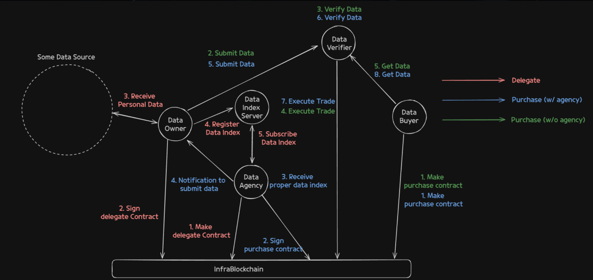
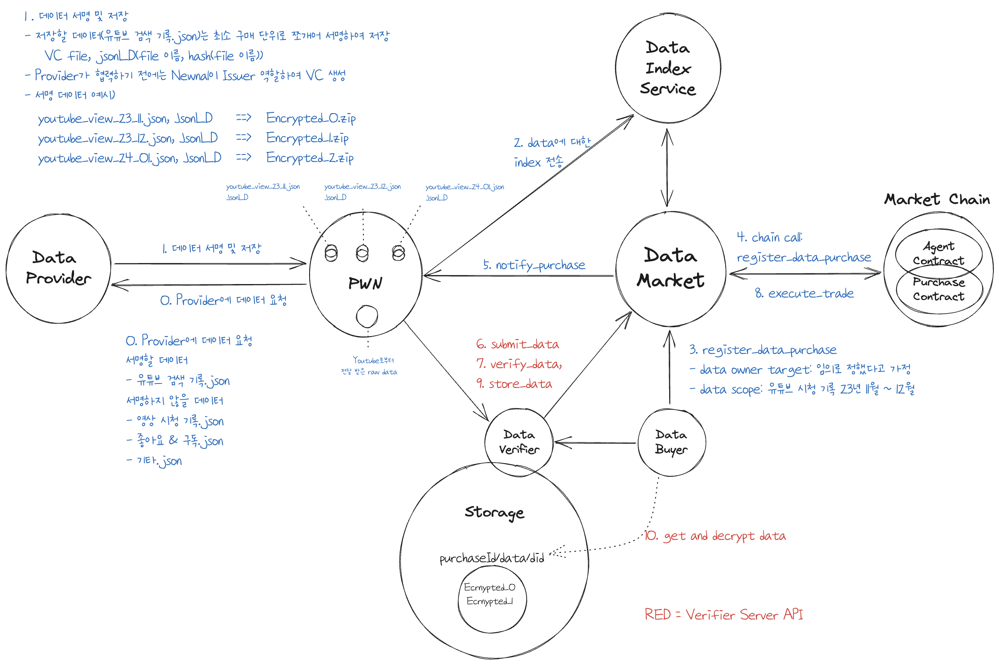
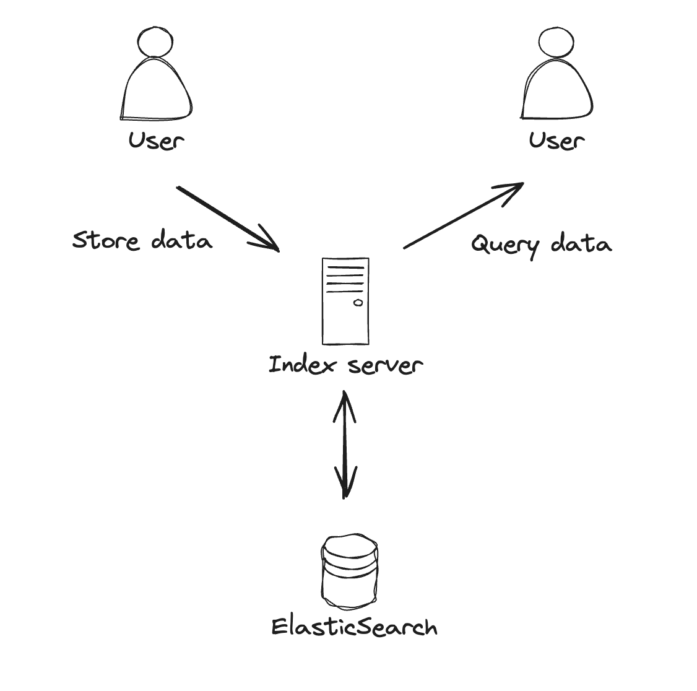
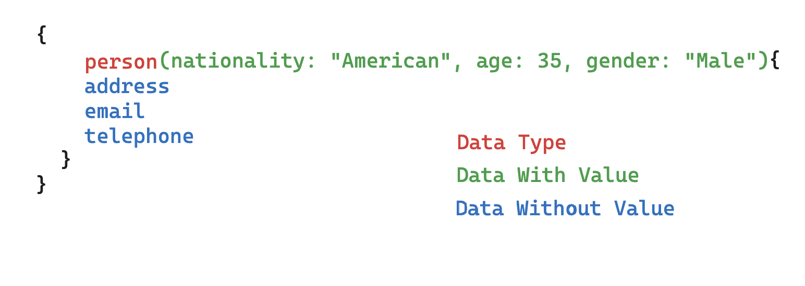
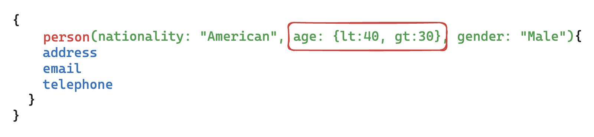
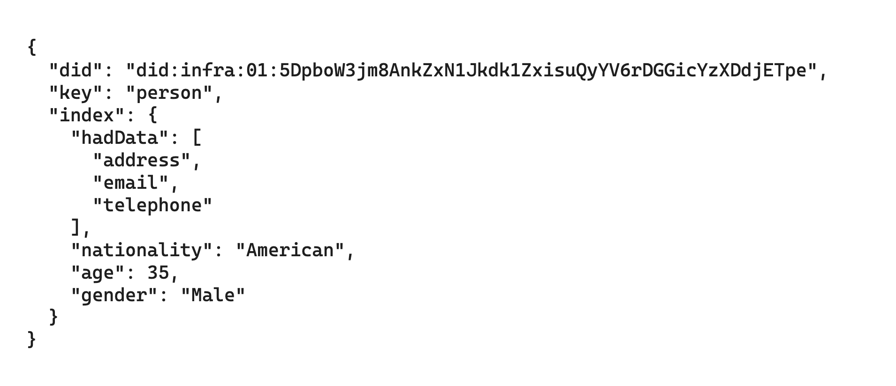
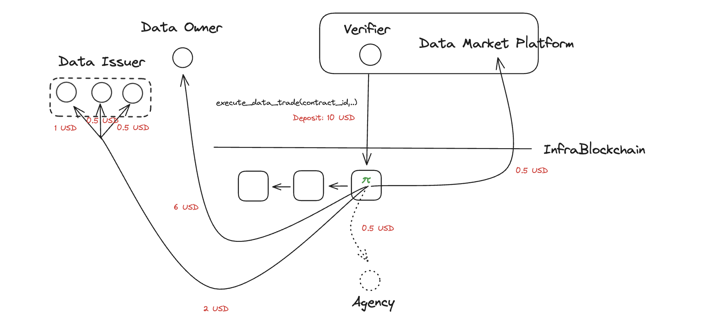

# Introduction

대형 언어 모델(LLM)과 같은 AI 기술의 급속한 발전으로 개인 데이터의 활용과 보안이 매우 중요한 이슈로 부각되고 있습니다. 현재 대부분의 사용자 데이터는 중앙 집중식 서버에 저장되며, 사용자는 자신의 데이터에 대한 접근이나 삭제와 같은 제어 권한을 충분히 갖지 못하고 있습니다. 이로 인해 사용자가 자신의 데이터를 관리하고 이를 거래할 수 있는 플랫폼이 거의 존재하지 않습니다. 또한, 특정 인증서나 의료 데이터뿐만 아니라 다양한 서비스의 데이터 출처와 무결성을 신뢰할 수 있는 방식으로 거래할 수 있는 플랫폼도 부족한 상황입니다.

***Newnal Data Market*은** 개인 데이터를 탈중앙화 및 검증 가능한 방식으로 자유롭게 거래할 수 있는 플랫폼입니다. 유저들은 Data Provider로부터 전달받은 검증 가능한 데이터(Verifiable Credential)를 개인 웹 노드(Personal Web Node)에 저장하고 이 데이터를 Data Package(Verifiable Presentation)로 구성하여 판매할 수 있습니다. 데이터 구매자는 데이터 출처와 무결성이 보장된 데이터를 구매할 수 있습니다. 또한 거래를 통해 이루어지는 모든 자금의 흐름이 온체인으로 이루어져 거래 투명성도 보장 받을 수 있게 됩니다.

# Participants



**`Buyer`**

데이터를 구매하는 주체.

**`Seller(Owner)`**

PWN을 운영하고 데이터를 판매하는 주체. PWN에 저장된 데이터를 Data Package로 구성하여 Verifier에게 제출

**`Agency`**

Seller 혹은 Buyer를 대신하여 Index 서버로부터 거래 조건에 맞는 데이터 판매자를 주기적으로 조회하여 Data Package 제출 알람 전송

**`Verifier`**

Buyer가 지정한 신뢰 기반 데이터 거래 검증자로서, Seller가 제출한 Data Package 검증. DID로 식별

**`PWN(Personal Web Node)`**

Data Owner가 운영하는 개인 웹 노드(PWN). PWN에 Data provider로부터 발급받은 개인 데이터가 저장되고, 해당 데이터의 index 정보를 Index Server에 저장.

**`Data Provider(Issuer)`**

데이터를 검증 가능한 형태(VC)로 유저에게 발급하는 각종 서비스. (e.g netflix, instagram, google)

**`PWN Index Server`**

PWN으로부터 DID의 식별 정보와 데이터 범주를 전달받아 인덱싱하고, 특정 조건에 부합하는 DID list를 제공하는 서버

**`Data Market Service`**

구매자, 판매자, Agent를 위한 인증 및 각종 기능, Data Market Chain 간 interaction 등을 담당

**`Datamarket Chain`**

Data Market의 서비스 로직을 포함하는 블록체인(parachain). 데이터 구매 등록 및 거래, agency 등록 및 위임 등의 Smart contract로 구성.

**`DID Chain`**

DID 관련 서비스 로직을 포함하는 블록체인(parachain). DID 등록 및 폐기, document 조회 및 수정 등의 Smart contract로 구성.

# Main Components

## Data Package

-   data-package는 Owner가 데이터 거래 조건에 맞게 개인 데이터를 구성한 zip 파일이며 VC와 File로 이루어져 있어 데이터 출처와 무결성을 검증할 수 있습니다.
    -   VC 서명 검증을 통해 데이터 출처를 적법하게 확인할 수 있습니다.
    -   File이 VC와 함께 발급된 데이터의 경우, File 이름과 동일한 VC(\*.json)의 digest credentialSubject를 통해 File의 출처와 무결성을 검증할 수 있습니다.
-   data-package의 파일 구조를 나타내는 index.json은 Owner가 서명한 VC 형태이며, file system과 유사한 형태로 이루어져 있습니다.
    -   "\_dataScope": 데이터 구매 시 구매자가 지정한 데이터 범위이며 Owner는 해당 scope와 일치하는 개인 데이터로 data package를 구성해야합니다.
    -   “\_type”: 해당 파일의 type을 나타냅니다. VC(Verifiable Credential), Bin(파일), Dir(폴더)
    -   Bin(파일) type의 경우, 반드시 파일 이름과 같은 VC가 존재하며 해당 VC는 digest와 originalFilename을 credentialSubject로 가져야만 합니다.

```json
{
	"_dataScope": "{ lifestyle(     category: \"Electronics\",     totalPrice: {amount: {lt:1000, gte:100}},     startTime: {gte: 1648517600, lt: 1648717600}     ) }",
	"purchaseElectronics.json": { "_type": "VC", "_digest": "someHash" },
	"facebook": {
		"_type": "DIR",
		"profile.json": { "_type": "VC", "_digest": "someHash" },
		"data": {
			"_type": "DIR",
			"facebookWatch2301-2404.json": { "_type": "VC", "_digest": "someHash" },
			"instagramImgs2404.json": { "_type": "VC", "_digest": "someHash" },
			"instagramImgs2404.jpg": { "_type": "BIN", "_digest": "someHash" }
		}
	}
}
```

**Data Package 생성 및 전달**

-   Owner는 index server 혹은 agency로부터 전달받은 dataScope(graphQL 쿼리)에 맞게 data-package를 생성합니다.
-   생성된 data package는 다음과 같은 형태로 verifier에게 제출됩니다
    -   data-package(ZIP) ⇒ buffer ⇒ base64 encoding ⇒ encryption(JWE)
-   Verifier는 역과정을 통해 data-package를 얻은 뒤 VC, file checksum, data scope를 검증합니다.

## Verifier

Verifier는 Owner로부터 data-package를 전달받아 검증하고, 검증 성공 시 거래 정산 (execute_trade) 트랜잭션을 실행하는 주체입니다. 구매 건에 대해 Buyer는 신뢰할 수 있는 Verifier를 지정할 수 있으며 Buyer가 직접 Verifier Server를 운영할 수도 있습니다.



Owner가 submit-data api를 호출하면 Verifier는 크게 세가지 작업을 수행합니다.

**`submit_data` api**: Owner가 Verifier에게 data-package를 제출하기 위한 api

-   Input Param
    -   구매 ID
    -   판매자 did
    -   jwe: Data Package를 암호화한 `JWE`
-   데이터 서명 및 암호화(ECDH-1PU)
    -   Owner와 Verifier 간 ECDH-1PU를 통해 데이터 암호화

**`verify_data` :** 암호화된 data-package를 복호화 및 검증(Verifier 내부 method)

-   데이터 복호화 및 검증
    -   복호화하여 data-package 획득
        -   복호화 과정에서 Owner에 대한 did 인증(ECDH-1PU)
    -   data-package 검증
        -   복호화된 data-package의 진위성과 데이터 범위(scope)를 검증합니다.
        -   진위성 검증: index.json 내 VC의 서명을 검증하고, 파일 데이터의 무결성을 VC의 digest 필드를 통해 확인합니다.

**`execute_trade`** : data-package 검증이 성공하면 거래 실행을 위한 트랜잭션 전송합니다.

-   검증 성공 시, 거래 정산을 위해 블록체인 상에 **`execute_trade`** 트랜잭션을 실행합니다.
-   트랜잭션 parameter
    -   구매 ID (contractId)
    -   Owner의 DID 공개키 (ownerDIDPk)
    -   데이터 발급자 목록 (dataIssuers: 각 VC의 issuer DID와 유효기간)
    -   데이터 무결성 검증용 proof (decryptedMessage의 SHA256 해시)

**`store_data`** : 구매자에게 data-package url을 전달하는 api

-   검증 완료된 data-package를 S3에 업로드하고, 해당 파일의 URL을 구매자에게 전달합니다.
-   구매자만 api를 호출할 수 있도록 인가 권한을 부여합니다.

## Index Server

Index Server는 각각의 PWN(Personal Web Node)이 보유하고 있는 데이터의 인덱스를 관리하는 중요한 구성 요소입니다. 이를 통해 데이터 마켓 참여자들은 어떤 데이터가 누구에게 있는지를 쉽게 파악할 수 있으며, 이를 바탕으로 효율적인 데이터 거래가 가능합니다.

### **Architecture**



Index Server는 다음과 같은 구성 요소로 이루어져 있습니다:

-   **PWN (Personal Web Node)**: 각 개인이 소유한 데이터의 인덱스를 저장하고 관리합니다.
-   **Index Server**: PWN에서 전송된 인덱스를 ElasticSearch에 저장하고, 사용자 요청에 따라 해당 인덱스를 검색합니다.
-   **ElasticSearch**: 인덱스 데이터를 저장하고, 고속 검색을 지원합니다.

PWN은 Index Server만의 독특한 Query Language를 사용하여 본인의 Index를 저장하거나, 특정 Index값을 보유하고 있는 DID 목록을 조회할 수 있습니다.

### Index Server Query Language


Index Server에서는 Index Data를 저장하거나 조회하고자 할 때 독특한 Query Language를 사용하고 있습니다.

기본적으로 GraphQL문법을 사용하지만 실제 각각의 필드가 GraphQL에서 사용되는 방식과는 차이가 있습니다.

`Data With Value` 부분은 기본적으로 key-value 형식으로 구성되어 있습니다. value는 `String`, `Number` , `Object` 등 타입에 구애받지 않고 정의할 수 있습니다.

또한 `Number` 타입에 대해서는 `gt`, `gte`, `lt`, `lte` 등 특정 값을 지정하지 않고 범위를 지정하여 표현하는 것도 가능합니다.



`Data Without Value` 부분은 key 값으로 구성되어 있습니다. 실제 값을 공개하지 않는 필드에 대해서 해당 필드의 key 값으로 구성되어 있습니다.

### **Store Data**

Index Server에 데이터 저장 시 Index Server에 전달된 Index Server Query Language는 ElasticSearch에 저장될 수 있는 포맷으로 변환되어 저장 됩니다.


예를 들어 위 사진과 같이 요청 되었다고 한다면 실제 ElasticSearch에는 아래와 같이 저장됩니다.



Index Server Query Language에서 Data Type에 해당하는 부분은 `key` 에 해당하며 Data With Value에 해당하는 부분은 `index` 필드 내의 각각 포함됩니다. Data Without Value 에 해당하는 부분은 `index` 필드 내 `hadData` 필드 내 Array 값으로 필드명이 포함됩니다.

### **Query Data**

Index Server에서는 Index Server Query에 맞는 조건을 가진 DID를 조회할 수 있습니다. 이 경우에도 Index Server Query Language를 ElasticSearch에서 사용할 수 있도록 DSL(Domain Specific Language) 형식으로 변환하여 사용합니다.

아래 코드는 TypeScript로 구현된 예시 코드입니다.

```tsx
/* ==== snip ==== */
const query = buildQuery(selection);
/* ==== snip ==== */
const result = await elasticsearchService.search({
	index: 'pwn-index-data',
	body: {
		query,
	},
});
```

주어진 조건에 맞는 DID를 획득하여 데이터 구매자가 데이터 구매 요청을 하거나, Agency가 데이터의 소유자에게 판매하도록 알림을 주는 등의 행동을 수행할 수 있습니다.

# Data Market Smart Contract

## Overview

_Newnal 데이터 마켓_ 은 블록체인 기반 데이터 마켓 플랫폼으로 스마트 컨트랙트를 활용하여 탈중앙성과 거래의 투명성을 보장한다. 데이터 구매자와 판매자가 P2P 방식으로 거래가 이루어질 수 있고 에이전시를 통한 거래 또한 지원한다. 어떠한 방식이든 양자간 데이터 거래 계약에 대한 서명이 포함되어야 거래가 이루어 질 수 있으며 계약은 블록체인을 통해 관리된다.

양자간 데이터 거래 계약에대한 합의가 된 이후에는 오프체인을 통해 판매자에서 구매자에게 데이터가 전송된다. 중간에 데이터 검증자가 존재하며 데이터 유효성을 검사한 후 블록체인 트랜잭션을 통해 데이터 거래에 대한 대금이 지급된다. 블록체인에는 데이터 마켓 수수료 및 데이터 건에 대한 금액이 상세히 명시되어 있으며 누구나 이를 검증할 수 있다.

데이터 판매를 대신 해주는 에이전시 모델 같은 경우 에이전시를 블록체인을 통해 관리하게 된다. 플랫폼에서 에이전시의 역할은 데이터 판매자를 대신해 구매자에게 판매자 데이터의 인덱싱 정보를 알려주어 데이터 거래 중개역할을 해주는 역할을 수행하며 이를 통해 데이터 거래가 이루어졌을 때 보상을 받게 된다. 에이전시에 대한 모든 정보, 에이전시의 등록 및 취소 등은 모두 블록체인을 통해 이루어진다.

## Contracts

_Newnal 데이터 마켓_ 은 데이터 구매자와 판매자 양자간 합의에 의해 데이터 거래가 이루어진다. 합의는 온체인에 등록된 계약서를 통해 관리되며 크게 **_Purchase_** 과 **_Delegate_** 컨트랙트로 나누어진다.

### Purchase

구매 컨트랙트의 경우 데이터 거래를 하기 위해 구매자와 판매자간(에이전시 모델이 아닌 경우) 혹은 판매자와 에이전시간(에이전시 모델의 경우) 이루어지는 컨트랙트이다.

-   에이전시가 없는 경우
    데이터 판매자와 구매자가 직접 거래하는 경우로 구매자가 먼저 트랜잭션을 통해 구매 컨트랙를 생성하여 구매 의사를 밝히게 된다. 데이터 소유자(판매자)는 컨트랙트에 명시된 `data_purchase_info` 를 확인하여 구매하고자 하는 데이터에 한해 제출하게 된다.
-   에이전시가 있는 경우
    일반적인 경우, 데이터 소유자(판매자)는 데이터 구매자와 직접적으로 거래하지 않고 에이전시를 통해 거래하게 된다. 데이터 소유자(판매자)는 직접 자신이 신뢰하여 데이터를 위임할 수 있는 에이전시를 [DelegateContract](notion://www.notion.so/Core-Team-3ff2a206088c48acb844d71e21e74828?p=b4da25a69eb84afcb1475e4cf41f12a6&pm=s#Delegate) 를 통해 지정하게 된다. 데이터 구매자는 이러한 Agency 와 _PurchaseContract_ 를 통해 어떠한 데이터를 구매할 것인지에 대한 계약을 맺게 된다.

어떠한 경우든 컨트랙트가 유효하려면 거래 당사자간 트랜잭션을 통한 서명이 필요하다. 컨트랙트는 `ContractId` 를 키로 갖는 스토리지에 매핑되어 관리된다.

```rust
pub struct PurchaseContract<AccountId, BlockNumber, Balance, AssetkInd> {
	pub data_buyer: AccountId,
	pub data_verifier: Option<AccountId>,
	pub effective_at: BlockNumber,
	pub expired_at: BlockNumber,
	pub data_purchase_info: DataPurchaseInfo<AnyText>,
	pub system_token_id: AssetkInd,
	pub agency: Option<AccountId>,
	pub price_per_data: Balance,
	pub deposit: Balance,
	pub trade_count: Quantity,
	pub data_trade_record: Vec<AccountId>,
	pub signed_status: ContractSigner<AccountId>,
}

```

**Components**

`data_buyer`

데이터 구매자 계정

`data_verifier`

데이터 구매자가 지정한 데이터 검증자 계정

`effective_at`

컨트랙트가 활성화 되는 시점

`expired_at`

컨트랙트가 만료되는 시점

`data_purchase_info`

데이터 구매 범위

`system_token_id`

데이터 거래 지불 수단

`agency`

에이전시 계정으로 에이전시가 있는 데이터 거래 시 반드시 명시되어야 하는 정보

`price_per_data`

데이터 건별 가격

`deposit`

데이터 구매자의 예치금

`trade_count`

데이터 거래 건수

`data_trade_record`

데이터 거래 기록으로 중복 거래 방지 및 거래 계정 저장 목적으로 사용

`signed_status`

거래 당사자(판매자와 구매자 혹은 에이전시와 구매자)간 서명 상태

### Delegate

위임 계약은 데이터 거래에 대한 에이전시가 있는 경우 판매자와 에이전시간 혹은 구매자와 에이전시간 작성하는 계약이다.

```rust
pub struct DelegateContract<AccountId, BlockNumber> {
	pub data_owner: AccountId,
	pub agency: AccountId,
	pub data_owner_minimum_fee_ratio: u32,
	pub deligated_data: AnyText,
	pub effective_at: BlockNumber,
	pub expired_at: BlockNumber,
	pub signed_status: ContractSigner<AccountId>,
}

```

**Components**

`data_owner`

데이터 판매자 혹은 소유자 계정

`agency`

데이터 소유자가 자신의 데이터 인덱스 정보를 위임할 에이전시 계정

`data_owner_minimum_fee_ratio`

데이터 소유자의 최소 수익 분배 비율

`effective_at`

컨트랙트 활성화 시점

`expired_at`

컨트랙트 만료 시점

`signed_status`

거래 당사자(소유자와 에이전시)간 서명 상태

## Execute



_Purchase_ 혹은 _Delegate_ 컨트랙트에 대한 합의가 이루어지면 판매자는 구매자에게 오프체인에서 데이터를 전송하게 되며 구매자가 지정한 데이터 검증자인 _Verifier_ 를 통해 유효성 검증을 하고 블록체인 트랜잭션을 통해 컨트랙트에 명시된 조건에 따라 대금이 지급되며 모든 이력은 체인을 통해 확인 가능하다. _Verfier_ 에 의해 대부분의 데이터 유효성 검증(e.g 스키마 확인, 데이터 판매 범위 등)이 이루어지며 스마트 컨트랙트에서는 데이터 거래 컨트랙트 자체에 대한 유효성 검증이 이루어진다.

### Validity

1. 컨트랙트에 명시된 Verfier 여부 확인: 실제 데이터 거래는 Verifier 를 통해 이루어져야 한다
2. 컨트랙트의 유효 시간 확인: 데이터 거래가 이루어지는 시점이 컨트랙트에 명시된 _effective_at_ 보다는 크고 _expired_at_ 보다는 작아야한다.
3. 에이전시 일치 여부 확인: 에이전시 모델일 경우, 데이터 컨트랙트에 명시된 agency 와 일치하는지 확인한다.
4. 컨트랙트 거래 건수 확인: 데이터 거래는 최대로 거래가 이루어질 수 있는 값이 명시되어있으며 이보다 많이 거래가 이루어질 수 없다.
5. 중복 거래 방지: 에이전시 모델이 아닌 경우, 데이터 판매자는 한번만 판매할 수 있다.
6. 수익 분배 비율: 데이터 마켓 플랫폼 정책으로 플랫폼이 정해놓은 전체 비율보다 많이 비율을 산정할 수 없다.

### Distribution

유효성 검증이 모두 통과되면 수익 분배가 이루어진다. _Newnal 데이터 마켓_ 은 _판매자_ , _데이터 공급자_ , _플랫폼_ , 에이전시 모델의 경우 _agency_ 까지 판매된 데이터에 대한 수익이 분배된다. 각 비율은 스마트 컨트랙트에 명시된 비율에 따라 나누어지며 모든 이력은 블록 체인에서 확인 가능하다. 데이터 공급자의 경우 데이터 공급에 대한 비율을 따로 측정하여 수익금이 분배된다.

### Proof

_Verfier_ 는 오프체인에서 데이터를 전달 받고 데이터에 대한 proof(e.g Hash) 를 트랜잭션에 포함시켜 전송한다. 해당 proof 는 블록체인 이벤트로 발생하여 저장공간을 차지하지 않고 기록이 남게 된다.

## Agency

데이터 구매자와 판매자가 직접 거래하지 않고 중간에 에이전시를 두고 거래를 진행할 수 있다. 일반적으로 데이터 판매자는 데이터 구매자를 지속적으로 모니터링하는 것이 어려우며 에이전시가 이를 대신 해주는 구조이다. 에이전시는 온체인에 등록한 후에 활동할 수 있다. 에이전시에 대한 여러 정보 또한 블록체인을 통해 확인 가능하다. 또한 더 이상 에이전시 활동을 하고 싶지 않으면 등록 취소 또한 트랜잭션을 통해 가능하다.

## Configuration

데이터 마켓 플랫폼에 대한 설정값으로 수익 분배 비율을 정의한다.

```rust
pub struct MarketConfiguration {
	pub total_fee_ratio: u32,
	pub min_platform_fee_ratio: u32,
}

```

**Components**

`total_fee_ratio`

총 수익 분배 비율

`min_platform_fee_ratio`

플랫폼 최소 수익 분배 비율

# Main processes

### Agency 등록

유저는 Agency 역할을 수행하기 위해 Datamarket Chain에 metadata(신원정보, 거래 수수료 등)를 포함한 트랜잭션을 실행

### 데이터 구매 w/ agency

1. (Buyer) 데이터 구매 등록
    - Data Market Chain에 **`register_data_purchase`** 트랜잭션 전송
    - agency list에서 원하는 agency를 선정
2. (Agency) 구매 계약 Sign
    - 1에서 생성된 데이터 구매 건 위임에 대해 Agency가 동의하면 서명 트랜잭션 전송
3. (Agency) 구매 조건에 맞는 데이터 판매자 DID list 조회
    - Index Service로부터 구매 조건에 맞는 데이터 판매자가 있는지 주기적으로 체크
4. (Agency) 판매자 DID list에 데이터 판매 요청 알람
5. (Seller) Verifier에게 데이터 제출
    - 데이터 구매 조건에 맞는 Data package 구성하여 Verifier에게 데이터 제출
6. (Verifier) Data package 검증
    - Data package 검증
7. (Verifier) Execute trade
    - 검증 성공하면 Market Chain에 **`execute_trade`** 트랜잭션 전송하여 거래 정산
8. (Buyer) 구매 데이터 조회
    - Verifier가 전달해준 url을 통해 데이터 조회

### 데이터 구매 w/o agency

1. (Buyer) 데이터 구매 등록
    - Data Market Chain에 **`register_data_purchase`** 트랜잭션 전송
2. (Seller) Verifier에게 데이터 제출
    - 데이터 구매 조건에 맞는 Data package 구성하여 Verifier에게 데이터 제출
3. (Verifier) Data package 검증
    - Data package 검증
4. (Verifier) Execute trade
    - 검증 성공하면 Market Chain에 **`execute_trade`** 트랜잭션 전송하여 거래 정산
5. (Buyer) 구매 데이터 조회
    - Verifier가 전달해준 url을 통해 데이터 조회

### 데이터 판매 w/ agency

1. (Seller) Sign delegate contract
    - 데이터 판매자가 보유한 데이터를 자동으로 판매하고 싶을 경우 Chain에 Agency를 선택하여 **`sign_delegate_contract`** 트랜잭션 전송
2. (Agency) Make delegate contract
    - 1의 판매자가 보유한 데이터 판매를 위임 받을 경우 **`make_delegate_contract`** 트랜잭션을 통해 서명
3. (Seller) Data Provider에게 전달받은 데이터 PWN에 저장
4. (Seller) 해당 데이터의 index를 Index Server에 저장
5. (Agency) 계약한 판매자의 데이터와 일치하는 데이터 구매 건 주기적으로 조회
6. 판매 가능한 데이터가 조회되면 판매자 did에게 데이터 판매 요청 알람
